<p align="center">
  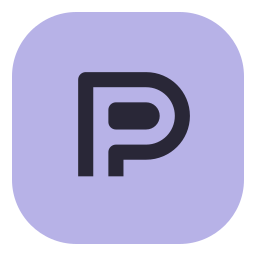
</p>

<h1 align="center">Prime Agent Studio</h1>

<p align="center"><strong>English</strong> · <a href="README.fr.md" lang="fr">Français</a></p>

<p align="center">
  <a href="https://github.com/zerr0o/PrimeAgentGUI/releases/latest"></a>
  <a href="https://github.com/zerr0o/PrimeAgentGUI/stargazers"></a>
  <a href="LICENSE"></a>
  <a href="#quick-start"></a>
  <a href="#quick-start"></a>
</p>

<p align="center">
  <strong>Your projects. Your agents. One workspace.</strong><br>
  A local French and English interface for Prime Agent, designed for Windows.
</p>

<p align="center">
  <a href="#quick-start">Quick start</a> ·
  <a href="#while-the-agent-is-working">Live messages</a> ·
  <a href="#images-and-attachments">Attachments</a> ·
  <a href="#your-models-within-reach">Models</a> ·
  <a href="docs/en/mcp.md">MCP connections</a> ·
  <a href="docs/en/providers.md">Providers</a> ·
  <a href="docs/en/commands.md">Commands and skills</a> ·
  <a href="docs/en/inspector.md">Agents and files</a> ·
  <a href="docs/en/lan.md">Mobile access</a> ·
  <a href="docs/en/pwa.md">Install the app</a> ·
  <a href="docs/en/translations.md">Languages</a> ·
  <a href="docs/en/development.md">Development</a>
</p>


<p align="center"><em>The real interface with demonstration data. This repository’s screenshots contain no personal conversations. Sample conversations and documents retain their original language.</em></p>

Prime Agent Studio brings your **local Prime Agent sessions** together in a browser application. Follow streaming responses, find your projects and continue a conversation without opening a terminal. On Windows, agents and their tools run in the background, without unexpected PowerShell windows.

**Version 2.6.0** — [Download the source code and read the release notes](https://github.com/zerr0o/PrimeAgentGUI/releases/latest). Choose project folders with the Windows picker and open skill and prompt folders directly from Studio.

## What’s new in version 2.6

- **Project folder**: **Choose folder** in the add-project dialog opens the Windows picker and fills in the path. Your project name is preserved; cancelling leaves the form unchanged.
- **Skills and prompts**: both tabs in **Commands and skills** offer **Global · All projects** or **Selected project**, followed by **Open folder**. A missing folder is created on demand.
- **Desktop and remote access**: the Windows picker is available in local Studio. Resource folders can also be opened from a remote connection with full control, on the host PC.
- **Bilingual documentation**: the README and guides are available in French and English.

## What’s new in version 2.5

- **French and English**: choose **Automatic / Français / English** in preferences or on the mobile sign-in page, with browser language detection.
- **Instant switching**: conversations, drafts, attachments and forms keep their contents, and running responses continue. Tabs at the same address share the language choice.
- **One table**: 1,051 messages keep their translations side by side. Parameters, plurals and references are checked automatically; missing or empty translations fall back to French.
- **Mobile and PWA**: sign-in, errors, sign-out, installation information and the offline screen follow the selected language.
- **More languages can be added**: the [translation guide](docs/en/translations.md) explains how to extend the table and check the interface.

<p align="center">
  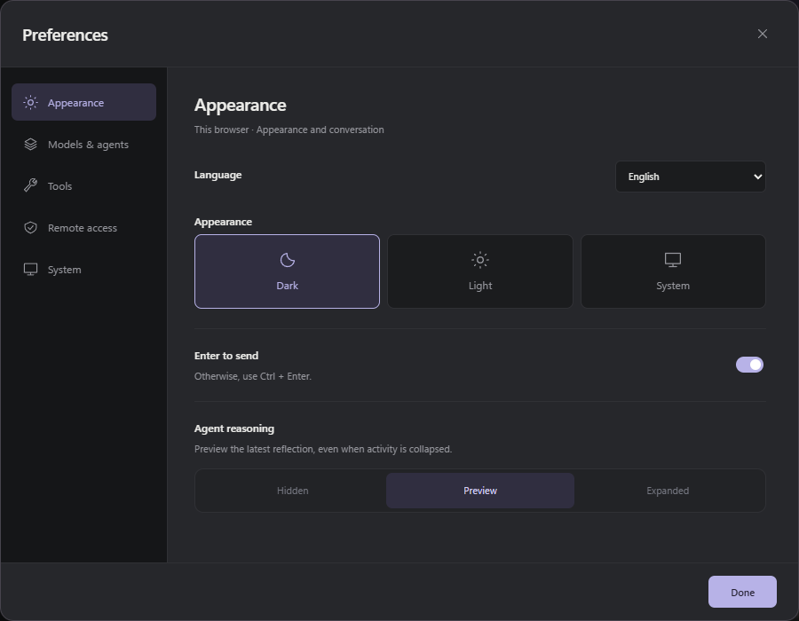
</p>

## What you can do

**Français or English**: open **Preferences → Appearance → Language** on desktop or mobile. **Automatic** follows the browser’s language. Changes apply immediately, preserve forms, drafts and attachments, and let agents keep working. The mobile sign-in page has its own selector; the PWA’s offline screen uses the selected language.

Translations live in **one table**, with French and English side by side for each message. Missing translations use French, and project checks detect absent entries and inconsistent parameters. [Add a language or translation](docs/en/translations.md).

| Feature                     | In Studio                                                                                                                |
| --------------------------- | ------------------------------------------------------------------------------------------------------------------------ |
| **Organize projects**       | Open their folders on the PC, pin them or remove them from Studio with confirmation; organize and resume their sessions. |
| **Follow progress**         | Read streaming responses and expand an activity block containing tools and reasoning.                                    |
| **Inspect a session**       | Check its status and usage, follow subagents and open their conversations without switching sessions.                    |
| **Browse files**            | Explore the project, read Git changes, preview and open files from desktop or mobile.                                    |
| **Intervene live**          | Steer the agent or queue a follow-up message without stopping its work.                                                  |
| **Attach images and files** | Select a photo or document, drop it into the conversation or paste it from the clipboard.                                |
| **Find your models**        | Search by name or provider, manage favorites and choose a reasoning level.                                               |
| **Configure subagents**     | Set the model and reasoning for future delegations, globally or per project, before the first message.                   |
| **Connect MCP tools**       | Manage HTTP and stdio servers, OAuth, variables, allowed tools and connection tests.                                     |
| **Manage providers**        | On the PC, connect an account, save an API key and remove credentials with confirmation.                                 |
| **Work in parallel**        | Run several sessions and switch between them.                                                                            |
| **Use Studio on mobile**    | Control the PC from a phone over Wi-Fi or Tailscale, protected by an access code.                                        |
| **Install Studio**          | Add a home-screen icon and open Studio in its own window over HTTPS.                                                     |

Runs continue when you switch sessions, reload the page or close the tab. The server must stay running.

Each project’s **⋯** menu also works on mobile; desktop supports right-click. Removing a project hides its Studio entry while preserving its folder and sessions. Add the folder again to find them. A project with an active run cannot be removed.

In the project list, the folder becomes a **green dot** while a session is working, or a **blue dot** when a completed response is unread. Green takes priority. The corresponding session also has a blue dot: read its latest response to clear it. This state survives reloads and is shared between tabs in the same browser; each device tracks it independently.

In remote Studio, **Preferences → Sign out** closes this browser’s access and returns to the access-code screen. Agents and other connected devices keep running.

On the PC, **Preferences → Remote access → Change code** changes the eight-digit PIN for Wi-Fi, Tailscale and the PWA. Devices must sign in again with the new code; agents continue without restarting Studio.

## Commands and skills within reach

Type **`/`** or use the **/** button beside attachments to find a command, skill or project prompt. Shortcuts open Studio panels; `/compact`, `/refine`, `/goal` and `/autonomous` run through Prime Agent, including in an active session’s queue. `/skill:name` loads a skill with your instructions. See the [commands, skills and prompts guide](docs/en/commands.md) for syntax and terminal-only commands.

Python skills are prepared according to the project’s native settings, for both the parent and its subagents. [Python configuration and repair of older installations](docs/en/configuration.md#python-and-skills) covers automatic setup and user-supplied `PRIME_AGENT_KERNEL_PYTHON` environments.

## Session, agents and files

The right panel has three tabs: **Session** for status and token usage, **Agents** for delegations and their conversations, and **Files** for browsing the project or reading Git changes. On phones, the panel button at the top right opens these views at full height.

Files open read-only, with Markdown rendering, indented JSON and a **Preview / Source** switch. Document links in conversations open the same viewer. **Open** launches the file in its application on the PC; on phones, the button says **Open on PC**. Git changes cover the entire project, including work from other sessions. The [panel guide](docs/en/inspector.md) explains live tracking and preview limits.

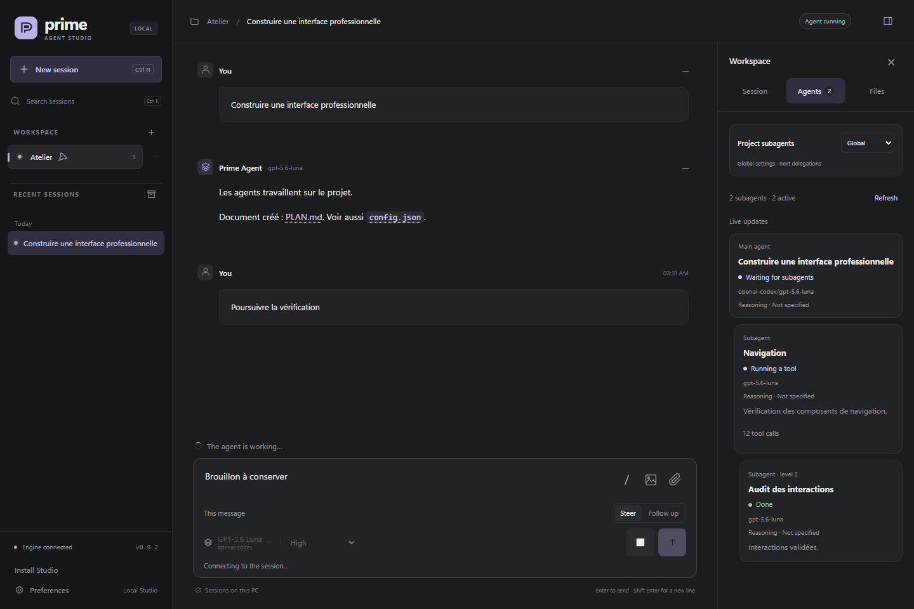

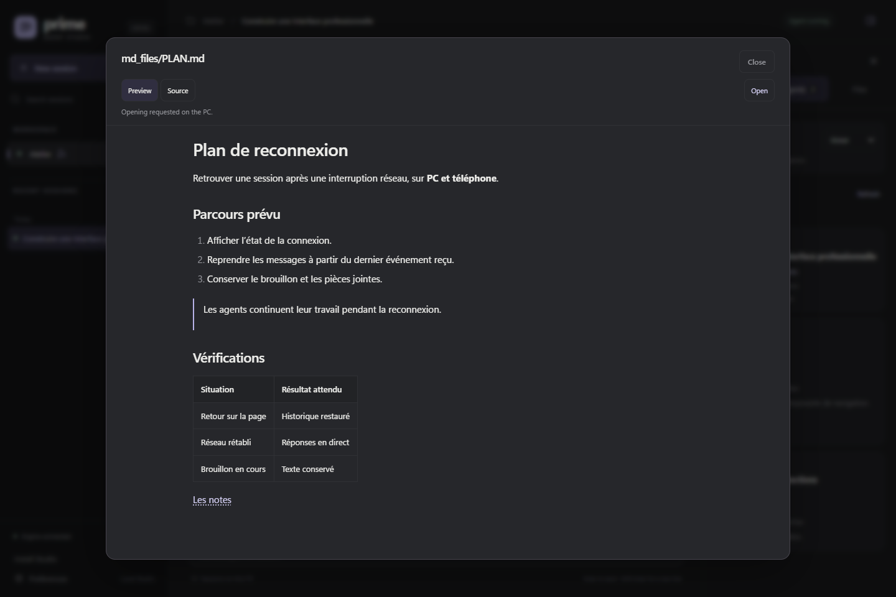

## Your MCP tools and services

**Preferences → Tools → Manage MCPs** lets you add, edit, test, enable or remove native Prime Agent connections. **HTTP** and **stdio** servers are supported, along with **OAuth**, variables and tool restrictions. Linear and Notion are offered as native integrations.

Connection tests discover tools without executing them. New settings apply to new sessions; existing sessions continue with their current configuration. See the [MCP guide](docs/en/mcp.md), including how to complete OAuth from a phone.

<p align="center">
  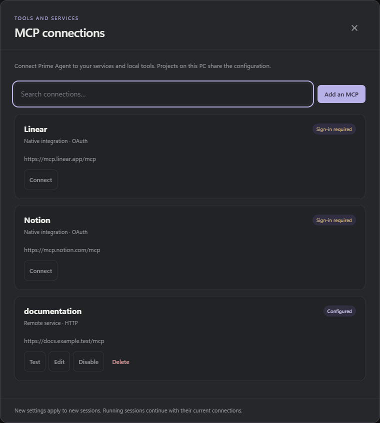
</p>

## Quick start

**Requirements:** Windows, **Node.js 22.8 or later**, and **Prime Agent 0.9.2** installed. Configure a provider before the first message, through the CLI or Studio’s desktop **Providers** panel. This version’s integration, including subagent settings, has been verified with **0.9.2**.

Download **Source code (zip)** from the [latest release](https://github.com/zerr0o/PrimeAgentGUI/releases/latest) and extract it, or clone this repository. Open a terminal in the extracted folder:

```powershell
npm ci
npm run setup:runtime
npm run start:silent
```

The browser opens at **[127.0.0.1:3088](http://127.0.0.1:3088)**. Afterward, double-click **`Lancer Prime Agent.vbs`**: the launcher reuses the server if it is already running.

1. Add a project folder with **+** in the workspace.
2. Open an existing session or choose **New session**.
3. Select a model, then write your request.

Studio reuses Prime Agent’s configuration: you do not need to paste an API key into the browser. Initial Python engine setup may require an Internet connection.

| Command                | Purpose                                           |
| ---------------------- | ------------------------------------------------- |
| `npm run start:silent` | Start in the background and open the browser.     |
| `npm run shortcut`     | Create a desktop shortcut.                        |
| `npm start`            | Start with logs in the terminal, for development. |
| `npm run stop`         | Close the server and its active runs.             |

**Closing the tab lets agents keep working.** **Stop** ends the selected run; `Arreter Prime Agent.vbs` or `npm run stop` closes all of Studio.

### Update a Git installation

Wait for active runs to finish, then run these commands in the Studio folder:

```powershell
npm run stop
git pull --ff-only
npm ci
npm run setup:runtime
npm run start:silent
```

Local settings and native Prime Agent sessions are preserved. For an archive installation, replace Studio’s files with the new release while keeping the `.local` folder, then repeat the installation steps.

**Upgrading from version 2.3 or earlier:** run `npm ci`, then `npm run setup:runtime`, and restart Studio to load the Python skills fix. Already-open kernels keep their environment until restarted.

## While the agent is working

The input remains available during a run. Choose when your message should take effect:

| Mode          | When the message is delivered                                  |
| ------------- | -------------------------------------------------------------- |
| **Steer**     | After the current step’s tools, to adjust the ongoing request. |
| **Follow up** | After the current response, to continue with a new request.    |

You can edit queued messages, reorder them, remove them or move them between modes. Engine acceptance is separate from actual delivery, which appears later in the conversation.

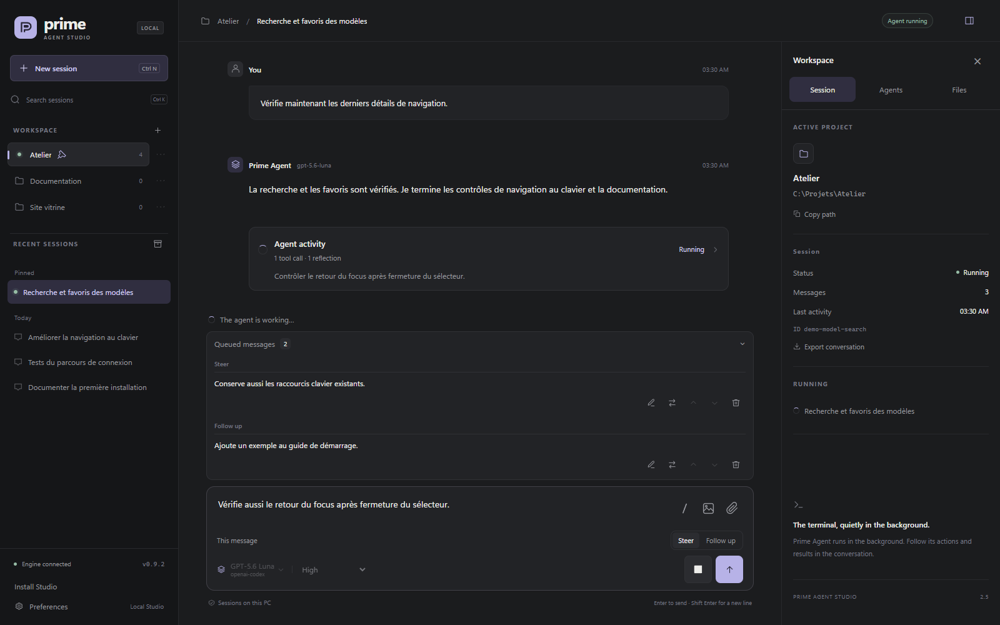

## Images and attachments

Two separate buttons accompany the input: **Photo** opens the phone or PC image picker; **Attachment** accepts any file type. You can also **drag and drop** files into the conversation, or **paste** images and documents provided to the browser by the clipboard. Normal text pasting remains available.

Previews let you remove an attachment before sending. Draft attachments stay in this browser after a reload. Send them on their own, with instructions, as **Steer** or as **Follow up**. In a conversation, click an image to enlarge it or a file to download it.

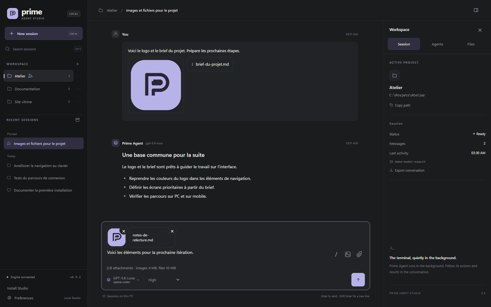

**PNG, JPEG, GIF and WebP** images are sent to the engine with their pixels; choose an image-capable model. Other files are stored on the PC, and their paths are passed to Prime Agent for its tools. Other image formats can be attached as files.

| Per message | Maximum count | Size per attachment | Combined size |
| ----------- | ------------- | ------------------- | ------------- |
| Images      | 4             | 4 MB                | 8 MB          |
| Files       | 8             | 10 MB               | 20 MB         |

You can combine images and files, up to **8 attachments in total**. These features also work on phones over Wi-Fi or Tailscale. Sent files are stored on the PC; drafts belong to the browser in which you prepare them.

## Your models within reach

On the PC, **Preferences → Models & agents → Manage connections** lets you connect accounts supported by Prime Agent, add or replace an API key, and remove credentials with confirmation. Search shows configuration status and credential sources. This panel is restricted to the PC’s local address; its routes are blocked remotely. The [provider guide](docs/en/providers.md) explains sign-in flows and behavior during active sessions.

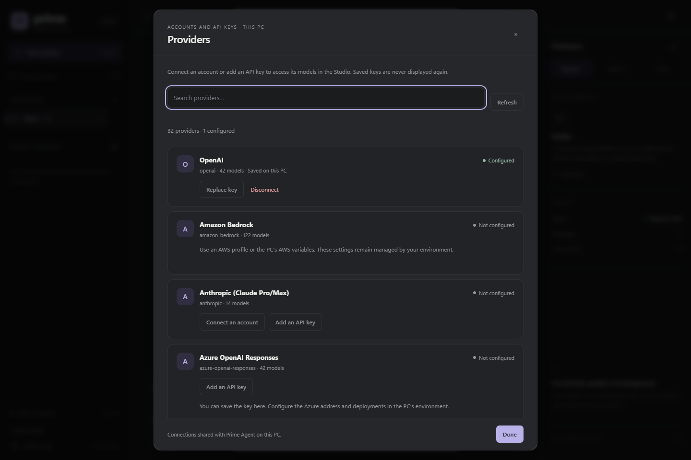

Find a model by **name, provider or ID**. Favorites stay at the top of the selector and are stored in your browser. The catalog depends on models available in your Prime Agent installation.

<p align="center">
  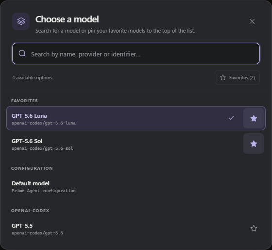
</p>

On the PC, **Preferences → Models & agents → Configure** lets you choose and save the default main model using the same selector, search and favorites as conversations. This panel also manages custom model definitions. **New session** and **Ctrl+N** use this default model, independently of the last model selected in a conversation.

With Prime Agent **0.9.2**, the **Subagents** area in preferences sets global defaults. For a specific project, select **This project** at the top of a conversation’s **Agents** tab, even before the first message, to show its selectors: changes save immediately. **Global** hides the selectors and restores shared defaults. Model selection uses the same catalog, integrated search and favorites as conversations. Each value can inherit from the parent. Studio adds these choices to the instructions and fills omitted arguments in future delegations; explicit choices and already-created subagents are preserved.

In **Preferences → Agent reasoning**, choose **Hidden**, **Preview** or **Expanded**. Preview shows the **last two lines** of the latest reflection in the activity block, with Markdown formatting and automatic tracking during generation. The **Agents** tab also shows the reasoning level actually used.

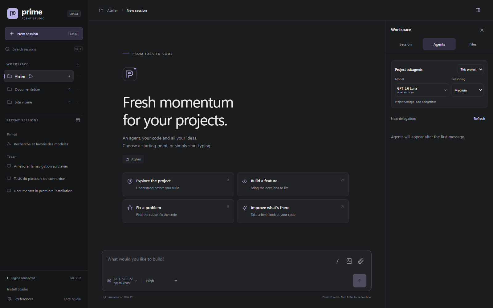

[Read the models and configuration guide →](docs/en/configuration.md)

## A space for each project

Find a project’s conversations, filter archived sessions and keep important exchanges pinned. Studio offers **dark, light and system** themes, local drafts, Markdown export and keyboard shortcuts.

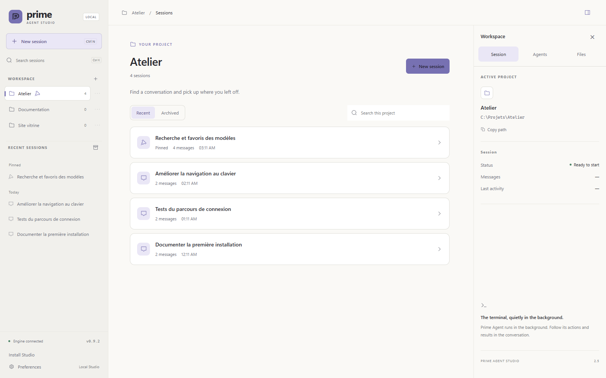

Studio titles, pins and archives are stored separately from native Prime Agent conversations.

## Also on your phone

On the PC, open **Preferences → Remote access** and enable **Local network**. Changes apply immediately without restarting or interrupting agents. On first activation, save the eight-digit PIN shown once.

Connect the phone to the same network as the PC, then use **Copy link** or **QR code**. The QR contains only the address; the PIN is requested at sign-in. Later activations preserve the PIN.

You can create or resume a session, send messages and follow progress live. The PC runs the agents and must stay on. The model configurator remains desktop-only.

Access uses HTTP on the local network with code authentication. Studio is a personal local application: it is not intended for exposure to the public Internet.

To use Studio **outside Wi-Fi, over 4G/5G**, connect the PC and phone to Tailscale, then enable **Tailscale** in the same category. Its link and QR are available immediately; LAN and the existing PIN are preserved. Network interfaces, the shared port and permissions are managed in the panel. The npm commands remain available for terminal configuration.

[Configure LAN, Tailscale, the code and read-only mode →](docs/en/lan.md)

## Install Studio as an application

Studio is an **installable PWA**. With Tailscale connected on the PC and phone, prepare its private HTTPS address:

```powershell
npm run pwa:enable
```

The command keeps your access code and displays an address such as `https://pc-name.network-name.ts.net`. Wait for runs to finish, then restart Studio. Open this address in the phone’s browser and choose **Install Studio**. On iPhone, use **Safari → Share → Add to Home Screen**.

The PWA keeps the website’s commands and attachments. If connectivity is lost, a **Try again** screen helps you reconnect. The PC is still needed to run agents; closing the app lets them keep working.

[Android, iPhone and desktop installation, HTTPS and offline behavior →](docs/en/pwa.md)

## Documentation

| Guide                                                 | Contents                                                                    |
| ----------------------------------------------------- | --------------------------------------------------------------------------- |
| [Configuration and data](docs/en/configuration.md)    | Models, defaults, storage and environment variables.                        |
| [Providers](docs/en/providers.md)                     | Account sign-in, API keys, sign-out and desktop-only access.                |
| [Mobile access](docs/en/lan.md)                       | Setup, network address, authentication and permissions.                     |
| [Installable application](docs/en/pwa.md)             | PWA installation, private HTTPS and reconnection.                           |
| [Development](docs/en/development.md)                 | Architecture, silent Windows processes, tests and reproducible screenshots. |
| [Agents and files](docs/en/inspector.md)              | Subagents, usage, Git changes, previews and document opening.               |
| [Commands and skills](docs/en/commands.md)            | Native commands, shortcuts, project skills and prompts.                     |
| [MCP connections](docs/en/mcp.md)                     | Servers, OAuth, tools and connection diagnostics.                           |
| [Languages and translations](docs/en/translations.md) | Interface translations and maintenance of both documentation languages.     |

To check the project:

```powershell
npm run check
npm test
npm run test:ui
npm run test:mobile
npm run test:attachments
npm run test:pwa
npm run test:inspector
npm run test:providers
```

Automated tests use temporary data and a simulated engine. Browser tests require Microsoft Edge; optional live tests with Luna are documented separately.

## License and attribution

Prime Agent Studio is developed by **[zerr0o](https://github.com/zerr0o)** and distributed under the [MIT license](LICENSE). Copyright © 2026 zerr0o.

You may use, modify and redistribute this project, including commercially, provided you keep **zerr0o’s** copyright notice and the license text in all copies or substantial portions of the software. [LICENSE](LICENSE) contains the [standard MIT license text](https://opensource.org/license/mit).

Prime Agent and third-party dependencies retain their respective licenses.

---

<p align="center">
  <strong>Prime Agent Studio</strong><br>
  A local interface around Prime Agent, with your existing sessions and configuration.
</p>
