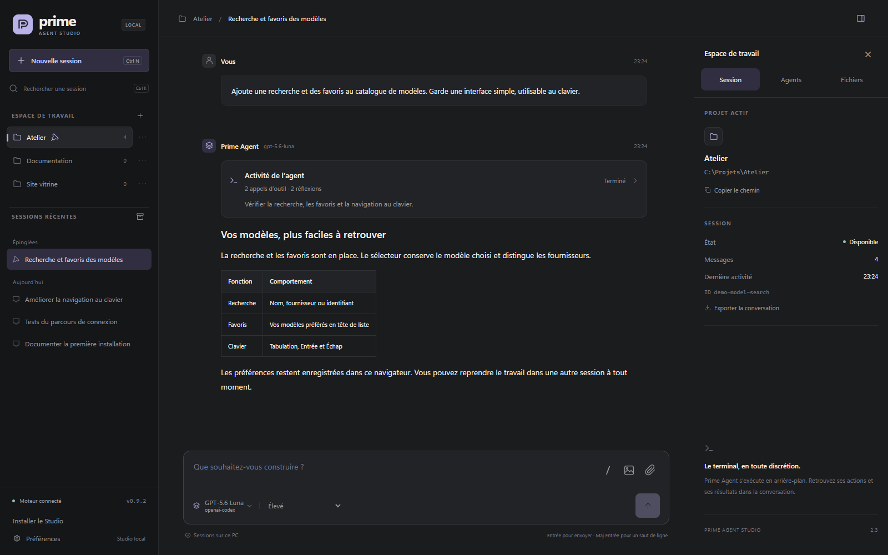
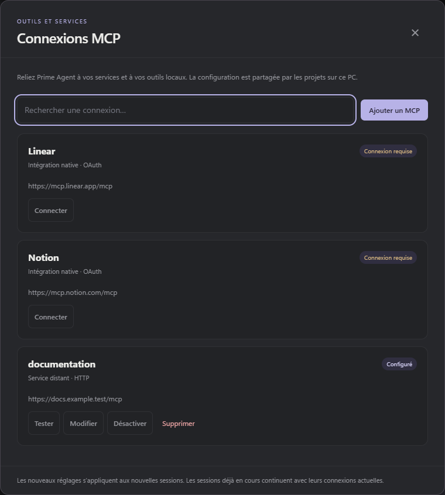
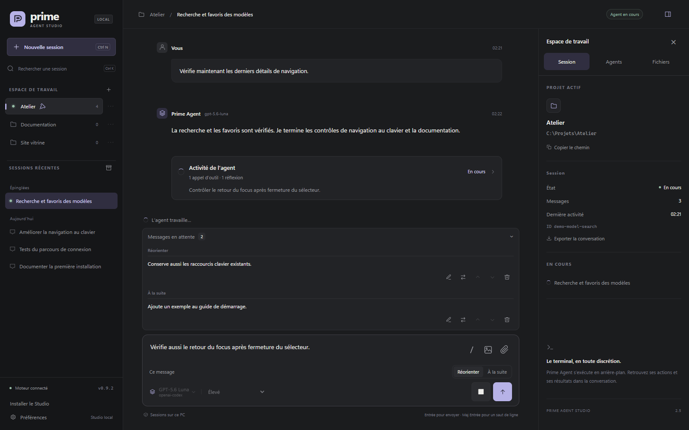
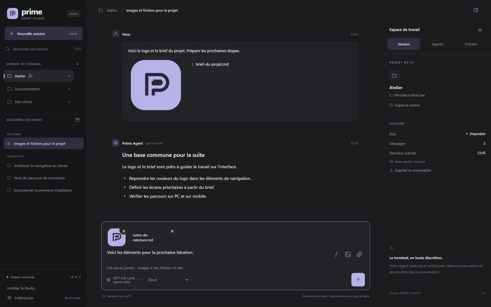
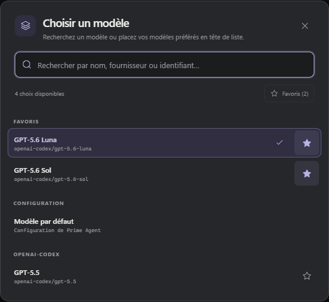
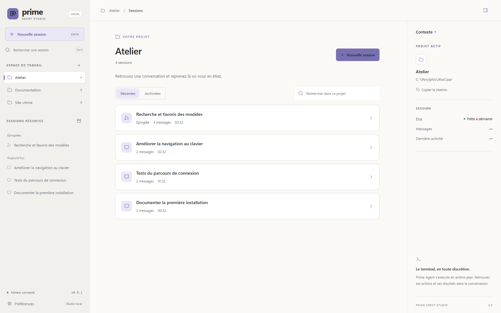

<p align="center">
  
</p>

<h1 align="center">Prime Agent Studio</h1>

<p align="center">
  <strong>Vos projets. Vos agents. Un seul espace de travail.</strong><br>
  Une interface locale en français pour Prime Agent, pensée pour Windows.
</p>

<p align="center">
  <a href="#démarrage-rapide">Démarrage rapide</a> ·
  <a href="#pendant-que-lagent-travaille">Messages en cours</a> ·
  <a href="#images-et-pièces-jointes">Pièces jointes</a> ·
  <a href="#vos-modèles-à-portée-de-main">Modèles</a> ·
  <a href="docs/mcp.md">Connexions MCP</a> ·
  <a href="docs/commands.md">Commandes et skills</a> ·
  <a href="docs/lan.md">Accès mobile</a> ·
  <a href="docs/pwa.md">Installer l’app</a> ·
  <a href="docs/development.md">Développement</a>
</p>



<p align="center"><em>L’interface réelle, avec des données de démonstration. Les captures de ce dépôt ne contiennent aucune conversation personnelle.</em></p>

Prime Agent Studio réunit les sessions de votre **Prime Agent local** dans une application accessible depuis le navigateur. Suivez les réponses en direct, retrouvez vos projets et continuez une conversation sans ouvrir de terminal. Sous Windows, les agents et leurs outils démarrent en arrière-plan, sans fenêtres PowerShell intempestives.

## Ce que vous pouvez faire

| Fonction                           | Dans le Studio                                                                                                                    |
| ---------------------------------- | --------------------------------------------------------------------------------------------------------------------------------- |
| **Organiser vos projets**          | Ouvrir leurs dossiers sur le PC, les épingler ou les retirer du Studio avec confirmation ; organiser et reprendre leurs sessions. |
| **Suivre le travail**              | Lire les réponses en streaming et déplier une activité regroupant les outils et le raisonnement.                                  |
| **Intervenir en direct**           | Réorienter l’agent ou préparer un message à la suite, sans arrêter son travail.                                                   |
| **Joindre des images et fichiers** | Choisir une photo ou un document, les déposer dans la conversation ou les coller depuis le presse-papiers.                        |
| **Retrouver vos modèles**          | Rechercher par nom ou fournisseur, gérer vos favoris et choisir le niveau de réflexion.                                           |
| **Connecter des outils MCP**       | Gérer les serveurs HTTP et stdio, OAuth, les variables, les outils autorisés et les tests de connexion.                           |
| **Travailler en parallèle**        | Lancer des exécutions dans plusieurs sessions et passer de l’une à l’autre.                                                       |
| **Retrouver le Studio sur mobile** | Piloter le PC depuis un téléphone en Wi-Fi ou via Tailscale, avec un code d’accès.                                                |
| **Installer le Studio**            | Ajouter une icône sur l’écran d’accueil et ouvrir le Studio dans sa propre fenêtre, via HTTPS.                                    |

Les exécutions continuent lorsque vous changez de session, rechargez la page ou fermez l’onglet. Le serveur doit rester en marche.

Le menu **⋯** de chaque projet fonctionne aussi sur mobile ; le clic droit est disponible sur PC. Retirer un projet masque son entrée dans le Studio et conserve son dossier et ses sessions. Vous pouvez retrouver ceux-ci en ajoutant à nouveau le dossier. Un projet avec une exécution active ne peut pas être retiré.

Dans le Studio distant, **Préférences → Se déconnecter** ferme l’accès de ce navigateur et revient au code d’accès. Les agents et les autres appareils connectés continuent de fonctionner.

## Commandes et skills à portée de main

Tapez **`/`** ou utilisez le bouton **/** près des pièces jointes pour rechercher une commande, un skill ou un prompt du projet. Les raccourcis ouvrent les panneaux du Studio ; `/compact`, `/refine`, `/goal` et `/autonomous` sont exécutés par Prime Agent, y compris dans la file d’une session active. `/skill:nom` charge un skill avec vos consignes. Consultez le [guide des commandes, skills et prompts](docs/commands.md) pour les syntaxes et les commandes réservées au terminal.

## Vos outils et services MCP

**Préférences → Connexions MCP → Gérer les MCP** permet d’ajouter, modifier, tester, activer ou supprimer des connexions natives de Prime Agent. Les serveurs **HTTP** et **stdio** sont pris en charge, avec les connexions **OAuth**, les variables d’environnement et les restrictions d’outils. Linear et Notion sont proposés comme intégrations natives.

Les tests découvrent les outils sans en exécuter. Les nouveaux réglages s’appliquent aux nouvelles sessions ; les sessions déjà en cours continuent avec leur configuration actuelle. Consultez le [guide MCP](docs/mcp.md), notamment pour effectuer une connexion OAuth depuis un téléphone.

<p align="center">
  
</p>

## Démarrage rapide

**Prérequis :** Windows, **Node.js 22.8 ou ultérieur**, Prime Agent installé et un fournisseur déjà configuré dans le CLI. L’intégration a été vérifiée avec **Prime Agent 0.9.1** ; les adaptations Windows ciblent cette version.

Dans le dossier du projet :

```powershell
npm ci
npm run setup:runtime
npm run start:silent
```

Le navigateur s’ouvre sur **[127.0.0.1:3088](http://127.0.0.1:3088)**. Ensuite, un double-clic sur **`Lancer Prime Agent.vbs`** suffit : le lanceur réutilise le serveur s’il est déjà ouvert.

1. Ajoutez le dossier d’un projet avec **+** dans l’espace de travail.
2. Ouvrez une session existante ou choisissez **Nouvelle session**.
3. Sélectionnez votre modèle, puis écrivez votre demande.

Le Studio réutilise la configuration de Prime Agent : aucune clé API à coller dans le navigateur. La préparation initiale du moteur Python peut nécessiter une connexion Internet.

| Commande               | Utilité                                                             |
| ---------------------- | ------------------------------------------------------------------- |
| `npm run start:silent` | Démarrer en arrière-plan et ouvrir le navigateur.                   |
| `npm run shortcut`     | Créer un raccourci sur le Bureau.                                   |
| `npm start`            | Démarrer avec les journaux dans le terminal, pour le développement. |
| `npm run stop`         | Fermer le serveur et ses exécutions actives.                        |

**Fermer l’onglet laisse les agents travailler.** Le bouton **Arrêter** termine l’exécution sélectionnée ; `Arreter Prime Agent.vbs` ou `npm run stop` ferme tout le Studio.

## Pendant que l’agent travaille

Le champ de saisie reste disponible pendant une exécution. Choisissez le moment où votre message doit être pris en compte :

| Mode           | Quand le message est transmis                                           |
| -------------- | ----------------------------------------------------------------------- |
| **Réorienter** | Après les outils de l’étape courante, pour ajuster la demande en cours. |
| **À la suite** | Après la réponse courante, pour enchaîner avec une nouvelle demande.    |

Vous pouvez modifier les messages en attente, les réordonner, les retirer ou les déplacer d’un mode à l’autre. L’acceptation par le moteur est distincte de la transmission effective, qui apparaît ensuite dans la conversation.



## Images et pièces jointes

Deux boutons distincts accompagnent le champ de saisie : **Photo** ouvre le sélecteur d’images du téléphone ou du PC ; **Pièce jointe** accepte tout type de fichier. Vous pouvez aussi **glisser-déposer** les fichiers dans la conversation, ou **coller** les images et documents que le navigateur reçoit du presse-papiers. Le collage de texte habituel reste disponible.

Les aperçus permettent de retirer une pièce avant l’envoi. Les pièces du brouillon restent dans ce navigateur après un rechargement. Vous pouvez les envoyer seules, avec une consigne, en **Réorienter** ou **À la suite**. Dans la conversation, cliquez sur une image pour l’agrandir ou sur un fichier pour le télécharger.



Les images **PNG, JPEG, GIF et WebP** sont transmises au moteur avec leurs pixels ; choisissez un modèle compatible avec les images. Les autres fichiers sont conservés sur le PC et leur chemin est transmis à Prime Agent pour ses outils. Les autres formats d’image peuvent être joints comme fichiers.

| Par message | Nombre maximal | Taille par pièce | Taille cumulée |
| ----------- | -------------- | ---------------- | -------------- |
| Images      | 4              | 4 Mo             | 8 Mo           |
| Fichiers    | 8              | 10 Mo            | 20 Mo          |

Vous pouvez combiner images et fichiers, dans la limite de **8 pièces jointes au total**. Ces fonctions sont aussi disponibles sur le téléphone, en Wi-Fi ou via Tailscale. Les fichiers envoyés sont conservés sur le PC ; les brouillons appartiennent au navigateur dans lequel vous les préparez.

## Vos modèles à portée de main

Recherchez un modèle par son **nom, son fournisseur ou son identifiant**. Les favoris restent en tête du sélecteur et sont enregistrés dans votre navigateur. Le catalogue dépend des modèles disponibles dans votre installation Prime Agent.

<p align="center">
  
</p>

Sur le PC, **Préférences → Modèles et valeurs par défaut → Configurer** permet de choisir le modèle principal par défaut et de gérer les définitions de modèles personnalisés.

Avec Prime Agent 0.9.1, les sous-agents héritent du modèle parent ; il n’existe pas de réglage global distinct pour eux. Une délégation peut demander un autre modèle via les capacités natives de Prime Agent.

[Consulter le guide des modèles et de la configuration →](docs/configuration.md)

## Un espace pour chaque projet

Retrouvez les conversations d’un projet, filtrez les sessions archivées et gardez les échanges importants épinglés. Le Studio propose les thèmes **sombre, clair et système**, des brouillons locaux, un export Markdown et des raccourcis clavier.



Les titres, épingles et archives du Studio sont conservés séparément des conversations natives de Prime Agent.

## Aussi depuis votre téléphone

Activez l’accès au réseau local :

```powershell
npm run lan:enable
```

La commande affiche l’adresse à ouvrir et un code à huit chiffres. **Attendez la fin des exécutions, puis redémarrez le Studio** pour appliquer la configuration. Connectez le téléphone au même réseau que le PC.

Vous pouvez créer ou reprendre une session, envoyer des messages et suivre le travail en direct. Le PC exécute les agents et doit rester allumé. Le configurateur de modèles reste réservé au PC.

L’accès utilise HTTP sur le réseau local, avec authentification par code. Le Studio est une application personnelle locale : il n’est pas destiné à être exposé sur Internet.

Pour accéder au Studio **hors du Wi-Fi, en 4G/5G**, connectez le PC et le téléphone à Tailscale, puis lancez sur le PC :

```powershell
npm run tailscale:enable
```

La commande affiche l’adresse Tailscale et conserve l’accès LAN ainsi que le code existant. Redémarrez le Studio après la fin des exécutions, puis ouvrez cette adresse sur le téléphone avec Tailscale activé.

[Configurer le LAN, Tailscale, le code et le mode lecture seule →](docs/lan.md)

## Installer le Studio comme une application

Le Studio est une **PWA installable**. Avec Tailscale connecté sur le PC et le téléphone, préparez son adresse HTTPS privée :

```powershell
npm run pwa:enable
```

La commande conserve votre code d’accès et affiche une adresse `https://nom-du-pc.nom-du-reseau.ts.net`. Attendez la fin des exécutions, puis redémarrez le Studio. Ouvrez cette adresse dans le navigateur du téléphone et utilisez **Installer le Studio**. Sur iPhone, passez par **Safari → Partager → Sur l’écran d’accueil**.

La PWA conserve les commandes et pièces jointes du site. En cas de coupure, un écran **Réessayer** permet de retrouver la connexion. Le PC reste nécessaire pour exécuter les agents ; fermer l’application les laisse travailler.

[Installation Android, iPhone et PC, HTTPS et fonctionnement hors ligne →](docs/pwa.md)

## Documentation

| Guide                                             | Contenu                                                                       |
| ------------------------------------------------- | ----------------------------------------------------------------------------- |
| [Configuration et données](docs/configuration.md) | Modèles, valeurs par défaut, stockage et variables d’environnement.           |
| [Accès mobile](docs/lan.md)                       | Activation, adresse réseau, authentification et permissions.                  |
| [Application installable](docs/pwa.md)            | Installation PWA, HTTPS privé et reconnexion.                                 |
| [Développement](docs/development.md)              | Architecture, processus Windows silencieux, tests et captures reproductibles. |

Pour vérifier le projet :

```powershell
npm run check
npm test
npm run test:ui
npm run test:mobile
npm run test:attachments
npm run test:pwa
```

Les tests automatiques utilisent des données temporaires et un moteur simulé. Les tests de navigateur nécessitent Microsoft Edge ; les tests réels facultatifs avec Luna sont documentés séparément.

---

<p align="center">
  <strong>Prime Agent Studio</strong><br>
  Une interface locale autour de Prime Agent, avec vos sessions et votre configuration existantes.
</p>
