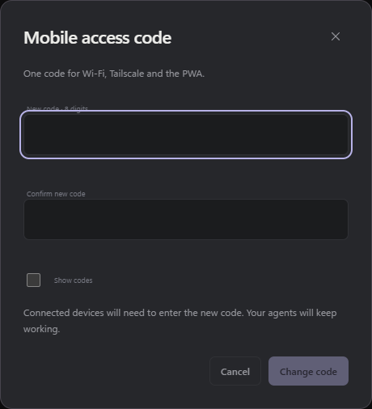

# Access from a phone

**English** · [Français](../lan.md) · [← Back to README](../../README.md)

## Use Studio from a phone

Mobile access is optional and protected by an eight-digit code. It provides Studio controls on the same Wi-Fi network: open projects and sessions, send messages, create or resume conversations, choose models, stop runs and organize projects and sessions. Agents work on the PC and continue when you close the phone’s browser.

```powershell
npm run lan:enable
npm run stop
npm run start:silent
```

The first command displays the local address and code. The phone’s browser asks for the code; a cookie remembers authentication for eight hours. Running `lan:enable` again renews the code. Configuration is saved in `.local/lan-access.json`; setting `enabled` to `false`, then restarting, disables this access. The PC must stay on and connected to the same network. If its IP address changes, run `lan:enable` again before restarting.

The mobile port is `3089`, bound only to the network adapter’s private address. Port `3088` remains reserved for the PC. No router or Internet tunnel is configured. The connection uses HTTP on your local network.

## Change the PIN on the PC

In the PC’s local interface, open **Preferences → Mobile access → Change code**. Enter and confirm a new **8-digit** code; a leading zero is accepted. The same code is used for Wi-Fi, Tailscale and PWA access.

The change applies immediately without restarting Studio. Already-connected devices are signed out and must enter the new code; agents keep working. Addresses, ports and permissions stay the same. The code is stored neither in plain text on the PC nor in browser storage.

This panel and its routes are restricted to the PC’s local address. It changes already-configured mobile access; if you forget the old code, you can choose a new one from the PC.



## Use remote controls

Choose a project from the menu to display its sessions, then tap a session to open it. **New session** prepares a conversation in that project. Archived sessions remain accessible through the **Archived** filter.

The **Photo** and **Attachment** buttons select images and any file type from the phone, respectively. Attachments transfer to the PC when sent, including through **Steer** or **Follow up**. Tap a received image to enlarge it, or a file to download it. Limits are the same as on desktop: [images and attachments](../../README.md#images-and-attachments).

The `readOnly: false` configuration enables remote controls. To deliberately limit access to viewing, change `readOnly` to `true`, then restart. Older configurations without this field remain read-only until explicitly updated. Changing mode preserves the existing code; restarting requires signing in again.

## Outside Wi-Fi with Tailscale

Install Tailscale on the PC and phone, connect them to the same Tailscale network—the same account for personal use—then enable the connection on both devices.

On the PC, from the Studio folder:

```powershell
npm run tailscale:enable
```

The command detects the Tailscale interface and displays `http://100.x.y.z:3089`. It preserves LAN access, the port, existing code and permissions. If remote access was not configured, it creates an eight-digit code and displays it once, without enabling LAN access.

Wait for runs to finish, then restart Studio. On the phone over 4G/5G, enable Tailscale and open the displayed address. Enter the usual code: projects, sessions, live messages and controls are the same as over Wi-Fi. This HTTP access works without Tailscale Serve; [PWA installation](pwa.md) uses Serve to provide HTTPS.

Studio opens a second listener on the Tailscale interface’s IPv4 address, in addition to the LAN listener. This gateway accepts only peers in Tailscale’s `100.64.0.0/10` range and local connections; Studio authentication is still required. Tailscale encrypts traffic between devices. The model configurator and desktop-only routes remain unavailable remotely.

Configuration is saved as `tailscale: { enabled: true, host: "100.x.y.z" }` inside `.local/lan-access.json`. To disable Tailscale HTTP access, set `tailscale.enabled` to `false` and restart. The main `enabled` field controls LAN only; the optional PWA gateway uses `tailscale.https.enabled`. These access methods share the code and `readOnly` mode but each requires its own browser sign-in.

Connect Tailscale before starting Studio. If its address changes, run `tailscale:enable` again, then restart Studio after runs finish. Running `lan:enable` again preserves the Tailscale address but renews the shared code.

If access fails from the phone, check that the PC is on, Tailscale is connected on both devices, and your Tailscale network and Windows Firewall rules allow the chosen port. A Tailscale startup error does not disable LAN access; diagnostics appear in `.local/logs/server.log`.

[Connecting devices: Tailscale documentation](https://tailscale.com/docs/how-to/connect-to-devices).

## Restart at the right time

Network configuration loads at startup. Wait for runs to finish before restarting Studio: `npm run stop` interrupts active sessions. Closing a browser tab, however, lets agents keep working.
