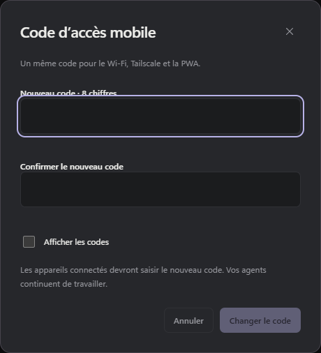

# Accès depuis un téléphone

[← Retour au README](../README.md)

## Utiliser le studio depuis un téléphone

L’accès mobile est facultatif, protégé par un code à huit chiffres. Il donne accès aux commandes du studio sur le même réseau Wi-Fi : ouvrir un projet et ses sessions, envoyer des messages, créer ou reprendre une conversation, choisir un modèle, arrêter une exécution et organiser les projets et sessions. Les agents travaillent sur le PC et continuent si vous fermez le navigateur du téléphone.

```powershell
npm run lan:enable
npm run stop
npm run start:silent
```

La première commande affiche l’adresse locale et le code. Le code est demandé dans le navigateur du téléphone ; il est mémorisé par un cookie pendant huit heures. Relancer `lan:enable` renouvelle le code. La configuration est conservée dans `.local/lan-access.json` ; mettre `enabled` à `false`, puis redémarrer, désactive cet accès. Le PC doit rester allumé et connecté au même réseau. Si son adresse IP change, relancer `lan:enable` avant le redémarrage.

Le port mobile est `3089`, lié uniquement à l’adresse privée de la carte réseau. Le port `3088` reste réservé au PC. Aucun routeur ni tunnel Internet n’est configuré. La connexion utilise HTTP sur votre réseau local.

## Modifier le code PIN sur le PC

Dans l’interface locale du PC, ouvrez **Préférences → Accès mobile → Changer le code**. Saisissez et confirmez un nouveau code de **8 chiffres** ; un zéro initial est accepté. Le code reste commun aux accès Wi-Fi, Tailscale et PWA.

Le changement s’applique immédiatement, sans redémarrage du Studio. Les appareils déjà connectés sont déconnectés et doivent saisir le nouveau code ; les agents continuent leur travail. Les adresses, les ports et les permissions restent identiques. Le code n’est enregistré ni en clair sur le PC, ni dans le stockage du navigateur.

Ce panneau et ses routes sont réservés à l’adresse locale du PC. Il permet de modifier un accès mobile déjà configuré ; si vous avez oublié l’ancien code, vous pouvez en choisir un nouveau depuis le PC.



## Utiliser les commandes à distance

Dans le menu, choisissez un projet pour afficher ses sessions dans la page, puis touchez une session pour l’ouvrir. **Nouvelle session** prépare une conversation dans ce projet. Les sessions archivées restent accessibles avec le filtre **Archivées**.

Les boutons **Photo** et **Pièce jointe** sélectionnent respectivement les images et tous types de fichiers du téléphone. Les pièces sont transférées au PC lors de l’envoi, y compris en **Réorienter** ou **À la suite**. Touchez une image reçue pour l’agrandir, ou un fichier pour le télécharger. Les limites sont les mêmes que sur PC : [images et pièces jointes](../README.md#images-et-pièces-jointes).

La configuration `readOnly: false` active les commandes à distance. Pour limiter volontairement cet accès à la consultation, passez `readOnly` à `true`, puis redémarrez. Une ancienne configuration sans ce champ reste en lecture seule jusqu’à sa mise à jour explicite. Le changement de mode conserve le code existant ; un redémarrage demande de se reconnecter.

## Hors du Wi-Fi avec Tailscale

Installez Tailscale sur le PC et le téléphone, connectez-les au même réseau Tailscale (le même compte pour un usage personnel), puis activez la connexion sur les deux appareils.

Sur le PC, dans le dossier du Studio :

```powershell
npm run tailscale:enable
```

La commande détecte l’interface Tailscale et affiche l’adresse `http://100.x.y.z:3089`. Elle conserve l’accès LAN, le port, le code existant et les permissions. Si aucun accès distant n’était configuré, elle crée un code à huit chiffres et l’affiche une seule fois, sans activer le LAN.

Attendez la fin des exécutions, puis redémarrez le Studio. Depuis le téléphone en 4G/5G, activez Tailscale et ouvrez l’adresse affichée. Saisissez le code habituel : les projets, sessions, messages en direct et commandes sont les mêmes qu’en Wi-Fi. Cet accès HTTP fonctionne sans Tailscale Serve ; [l’installation PWA](pwa.md) utilise Serve pour fournir HTTPS.

Le Studio ouvre une seconde écoute sur l’adresse IPv4 de l’interface Tailscale, en plus de celle du LAN. Cette passerelle n’accepte que les pairs de la plage Tailscale `100.64.0.0/10` et les connexions locales ; l’authentification du Studio reste obligatoire. Le trafic entre appareils est chiffré par Tailscale. Le configurateur de modèles et les routes réservées au PC restent inaccessibles à distance.

La configuration est conservée dans `tailscale: { enabled: true, host: "100.x.y.z" }` au sein de `.local/lan-access.json`. Pour désactiver l’accès HTTP Tailscale, passez `tailscale.enabled` à `false` et redémarrez. Le champ `enabled` principal contrôle uniquement le LAN ; l’éventuelle passerelle PWA utilise `tailscale.https.enabled`. Ces accès partagent le code et le mode `readOnly`, mais demandent chacun une connexion dans le navigateur.

Connectez Tailscale avant de lancer le Studio. Si son adresse change, relancez `tailscale:enable` puis redémarrez le Studio après la fin des exécutions. Relancer `lan:enable` conserve l’adresse Tailscale mais renouvelle le code partagé.

En cas d’échec depuis le téléphone, vérifiez que le PC est allumé, que Tailscale est connecté sur les deux appareils et que les règles de votre réseau Tailscale et du pare-feu Windows autorisent le port choisi. Une erreur Tailscale au démarrage ne désactive pas le LAN ; les diagnostics apparaissent dans `.local/logs/server.log`.

[Connexion entre appareils : documentation Tailscale](https://tailscale.com/docs/how-to/connect-to-devices).

## Redémarrer au bon moment

La configuration réseau est chargée au démarrage. Attendez la fin des exécutions avant de redémarrer le Studio : `npm run stop` interrompt les sessions encore actives. Fermer un simple onglet, en revanche, laisse les agents travailler.
